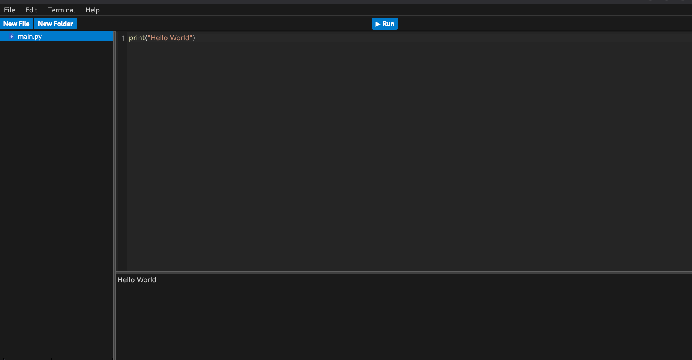

# M-Code-Editor




A minimal code editor built as a learning project.

The editor provides a simple graphical interface for editing text and Python files,
with support for local file system navigation.

## Description

The project implements core editor functionality with a focus on simplicity
and a clear, maintainable code structure.

At the moment, only plain text files and Python source files are supported.


## Features

- Minimal graphical user interface
- Text editing for `.txt` and `.py` files
- File system navigation
- Simple and clean project structure
- simple build in Terminal for output
- clean menubar

## Technology

- Python
- PySide6 (Qt)

## Usage

```bash
git clone https://github.com/m356276/m-code-editor.git
cd m-code-editor
python -m venv venv
source venv/bin/activate
pip install PySide6
python main.py
```

## Leave a Star
If you like this project, feel free to give it a star.

